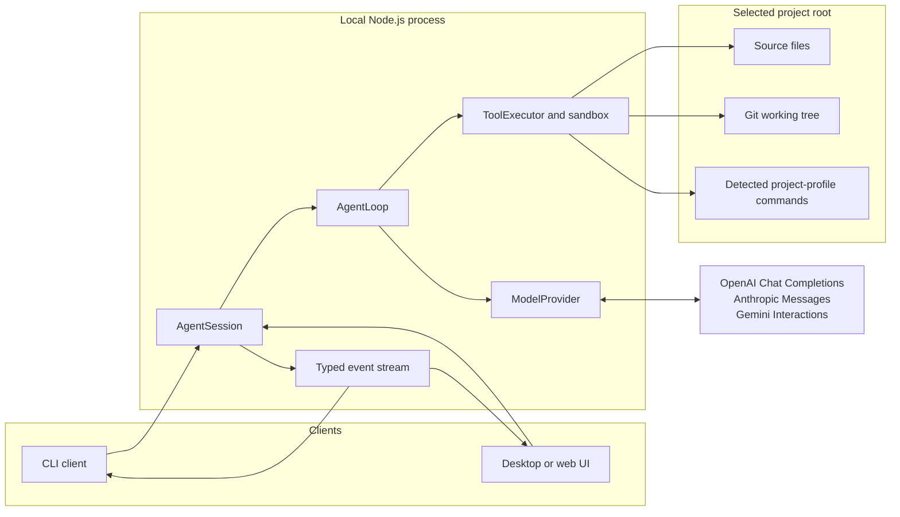

# CodeSmith Architecture

This document describes how CodeSmith is structured, configured, and operated.

## System design



## Source layout

| Directory        | Responsibility                                                |
| ---------------- | ------------------------------------------------------------- |
| `src/agent/`     | Session lifecycle, agent loop, and emitted events             |
| `src/providers/` | Model catalog and provider API adapters                       |
| `src/workspace/` | Sandboxing, project profiles, command policy, and local tools |
| `src/cli/`       | CLI entry point and interactive setup                         |
| `src/shared/`    | Cross-domain error and protocol types                         |
| `src/core/`      | Public, UI-neutral Agent Core facade                          |
| `tests/`         | Tests mirroring the production domain folders                 |

`src/core/agent-core.ts` remains the package's public, UI-neutral entry point.

### Provider API migration

`ModelProvider` replaces the former `OpenAICompatibleProvider`. Construct it
with an explicit `modelCatalog` entry and API key, as shown in the Agent Core
API example below.

## Running the CLI

### Requirements

- Node.js 22 or newer
- An API key for a supported OpenAI, Anthropic, or Google Gemini model

### Setup

```sh
npm install

npm start -- --project /absolute/path/to/project
```

At startup, CodeSmith displays a grouped, numbered catalog of current
tool-capable models from OpenAI, Anthropic, and Google Gemini. Choose a model
number, then enter that provider's API key in a masked prompt. The key exists
only for the current process and is never read from or written to environment
variables, files, or a keychain.

Use `--yes` only when you want to automatically approve every proposed edit,
Git inspection, and allowlisted command:

```sh
npm start -- --project /absolute/path/to/project --yes
```

Type `/exit` or `/quit` to end an interactive CLI session.

## Agent Core API

Import the public core entry point to use the agent from a desktop or web
client:

```ts
import { AgentSession, ModelProvider, modelCatalog } from "codesmith";

const model = modelCatalog.find((entry) => entry.model === "gpt-5.4");
if (!model) throw new Error("The requested model is not in the CodeSmith catalog.");

const provider = new ModelProvider({
  model,
  apiKey: "supply this from your application's secure input flow",
});
const session = await AgentSession.create({
  projectRoot: "/absolute/path/to/project",
  provider,
});

const unsubscribe = session.subscribe((event) => {
  if (event.type === "approval_requested") {
    showApprovalDialog(event.summary, (approved) => {
      session.approve(event.requestId, approved);
    });
  }
});

const response = await session.submit("Create HelloWorld.swift.");

unsubscribe();
session.close();
```

`submit()` processes one prompt at a time. `approve(requestId, approved)`
resolves a pending edit or command approval and returns `false` for an unknown
or already-resolved ID. `close()` rejects future prompts, denies pending
approvals, and stops subsequent tool execution.

`modelCatalog` is the reviewed, built-in source of provider model IDs and
endpoints. It uses the OpenAI Chat Completions, Anthropic Messages, and Google
Gemini Interactions APIs, normalizing their tool calls for `AgentSession`.
Gemini Interactions uses Google-managed server-side conversation state to
continue a session's tool calls and responses; review Google's retention terms
before selecting a Gemini model.

### Events

`subscribe()` receives typed lifecycle events suitable for a GUI or TUI:

| Event                | Purpose                                                    |
| -------------------- | ---------------------------------------------------------- |
| `status`             | Agent is `thinking`, `waiting_for_approval`, or `complete` |
| `assistant_text`     | Final assistant response text                              |
| `tool_proposed`      | Model requested a tool call                                |
| `tool_started`       | A local tool is about to execute                           |
| `tool_finished`      | A tool completed with its structured JSON result           |
| `approval_requested` | Client must call `approve()` with the supplied request ID  |
| `error`              | Session or provider failure                                |

The core does not own terminal input or UI rendering. The CLI uses `readline`
to display approval requests; a GUI can render the same events as chat
messages, timelines, diff previews, and approval dialogs.

## Agent execution flow

1. A client submits a prompt to an `AgentSession`.
2. The core sends bounded conversation history and structured tool definitions
   to the provider.
3. The model returns assistant text or tool calls.
4. Tool calls execute locally through the sandboxed executor, subject to
   approval policy.
5. Structured tool results return to the model until it produces a final
   response.

Conversation context persists within a session. Brief replies such as `yes`,
`no`, `proceed`, and `do it` are interpreted in the context of the agent's
immediately preceding unresolved question.

## Local tools and approvals

The provider can request these structured local operations:

- List, search, and read UTF-8 text files.
- Create or delete a new/existing regular file directly in the selected
  project root.
- Apply an exact, unique text replacement to an existing UTF-8 file.
- Inspect `git status --short` and hardened `git diff`.
- Run exact commands from the selected project's detected profile.

All edits, Git operations, and commands require explicit approval unless
`--yes` or `autoApprove: true` is used.

### Project profiles

CodeSmith detects project markers in the selected root and exposes only the
matching exact commands. In mixed-language repositories, the profile combines
the commands for every detected marker. If no marker is recognized, file and
Git tools remain available but `run_command` exposes no commands.

| Profile                 | Detection                                           | Exact commands                                                                         |
| ----------------------- | --------------------------------------------------- | -------------------------------------------------------------------------------------- |
| Swift Package           | `Package.swift`                                     | `swift build`, `swift test`                                                            |
| Xcode                   | Root `.xcodeproj`                                   | `xcodebuild build`, `xcodebuild test`                                                  |
| JavaScript / TypeScript | `package.json`; TypeScript also has `tsconfig.json` | `npm test`, `npm run build`, and `npm run lint`, only when their package scripts exist |
| Python                  | `pyproject.toml`, `requirements.txt`, or `setup.py` | `python -m pytest`, `python -m compileall .`                                           |
| Rust                    | `Cargo.toml`                                        | `cargo build`, `cargo test`, `cargo clippy`                                            |
| Go                      | `go.mod`                                            | `go build ./...`, `go test ./...`                                                      |

Commands never run through a shell, cannot accept model-supplied flags or
arguments, and retain the same approval, output, timeout, cancellation,
project-root, and non-secret-environment protections. New ecosystem support is
added as an explicit profile rather than widening shell access.

## Safety model

- All workspace paths are constrained to the canonical selected root. Traversal,
  escaping symlinks, root replacement, and multi-link patch targets are
  rejected.
- `.git` internals are blocked, including Git worktree pointer files.
- Creation and deletion are deliberately limited to root-level files. Create
  directories manually before asking the agent to edit nested paths.
- Patch content and created-file content are capped at 500 characters and 10
  MB. Edit previews escape terminal control characters.
- Commands run without a shell and with a fixed, non-secret `PATH`.
- Commands and Git inspection use a minimal subprocess environment. Git diff
  disables external diff and text-conversion helpers.
- Closing a session prevents new side effects and terminates active command
  process groups.
- Provider credentials stay in the provider client. Provider error diagnostics
  are bounded and redact configured and token-shaped credentials.

## Development

```sh
npm test
npm run build
npm run lint
```

The test suite covers provider request formatting and redaction, session
lifecycle and approval events, sandbox containment,
symlink/hard-link/root-replacement protections, tool approvals, and the mocked
agent loop.

Use `npm run lint:fix` to apply ESLint fixes and `npm run format` to format the
repository with Prettier. The pre-commit hook automatically applies both tools
to supported staged files.
