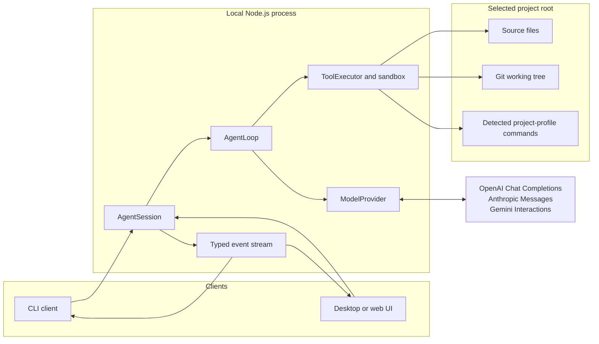

# CodeSmith architecture

> **Living document:** Use this guide to orient contributors and coding agents.
> Update it when a layer boundary, public API, supported integration, or security
> control changes.

CodeSmith is an experimental, local TypeScript coding agent. This guide explains
how its parts work together, where to make changes, and the controls that limit
its access to a selected project.

## 1. Project structure

```text
.
├── src/
│   ├── agent/       # Session lifecycle, agent loop, and typed events
│   ├── cli/         # Interactive command-line entry point and setup
│   ├── core/        # Public, UI-neutral package API
│   ├── providers/   # Model catalog and provider protocol adapters
│   ├── shared/      # Cross-layer types and errors
│   └── workspace/   # Project sandbox, tools, and command policy
├── tests/           # Tests that mirror the production domain folders
├── README.md        # Project overview and local CLI setup
└── ARCHITECTURE.md  # This architecture reference
```

Keep terminal interaction in `src/cli/`, the reusable public API in `src/core/`,
and workspace access controls in `src/workspace/`. Provider-specific protocol
code belongs in `src/providers/`, not in the agent loop.

## 2. System overview



## 3. Core components

| Component        | Responsibility                                                     |
| ---------------- | ------------------------------------------------------------------ |
| `src/agent/`     | Owns session lifecycle, bounded agent execution, and events        |
| `src/providers/` | Adapts supported model protocols to the shared provider API        |
| `src/workspace/` | Enforces sandboxing, tool approvals, and command allowlists        |
| `src/cli/`       | Collects local input and renders approval prompts                  |
| `src/shared/`    | Defines cross-layer types and error types                          |
| `src/core/`      | Exposes the public, UI-neutral Agent Core API                      |
| `tests/`         | Mirrors production domains with focused unit and integration tests |

The public, UI-neutral entry point is `src/core/agent-core.ts`.

### Provider integration

`ModelProvider` replaces `OpenAICompatibleProvider`. Pass it a `modelCatalog`
entry and an API key, as shown below.

### Agent Core integration

Import the public entry point to use CodeSmith in a desktop or web client.

```ts
import { AgentSession, ModelProvider, modelCatalog } from "codesmith";

const model = modelCatalog.find((entry) => entry.model === "gpt-5.4");
if (!model) throw new Error("The requested model is not in the CodeSmith catalog.");

const provider = new ModelProvider({
  model,
  apiKey: "supply this from your application's secure input flow",
});
const session = await AgentSession.create({
  projectRoot: "/absolute/path/to/project",
  provider,
});

const unsubscribe = session.subscribe((event) => {
  if (event.type === "approval_requested") {
    showApprovalDialog(event.summary, (approved) => {
      session.approve(event.requestId, approved);
    });
  }
});

const response = await session.submit("Create HelloWorld.swift.");

unsubscribe();
session.close();
```

`submit()` runs one prompt at a time. `approve(requestId, approved)` resolves a
pending edit, command, or model-download approval. It returns `false` if the
request ID is unknown or already resolved. `close()` rejects future prompts,
denies pending approvals, and stops later tool execution.

Set `semanticMemory: true` to opt into local semantic episodic memory. To
experiment with retrieval selectivity, use
`semanticMemory: { similarityThreshold: 0.55 }`; the threshold must be a finite
number from 0 to 1. Call `clearEpisodicMemory()` while the session is idle to
discard its stored episodes immediately.

`modelCatalog` is CodeSmith's reviewed source of provider model IDs and
endpoints. It supports the OpenAI Chat Completions, Anthropic Messages, and
Google Gemini Interactions APIs. It converts their tool calls into the format
that `AgentSession` uses.

Gemini Interactions keeps conversation state on Google-managed servers. Review
Google's retention terms before you choose a Gemini model.

### Event contract

`subscribe()` receives typed events that a GUI or TUI can use.

| Event                | Meaning                                                        |
| -------------------- | -------------------------------------------------------------- |
| `status`             | The agent is `thinking`, `waiting_for_approval`, or `complete` |
| `assistant_text`     | The final text response from the agent                         |
| `tool_proposed`      | The model asked to call a tool                                 |
| `tool_started`       | A local tool is about to run                                   |
| `tool_finished`      | A tool returned a structured JSON result                       |
| `approval_requested` | The client must call `approve()` with the request ID           |
| `memory_recorded`    | An episodic-memory record was added                            |
| `memory_retrieved`   | Relevant episode IDs and similarity scores informed a prompt   |
| `memory_cleared`     | Episodic-memory records were discarded                         |
| `memory_failed`      | Local memory initialization, retrieval, or recording failed    |
| `error`              | The session or provider failed                                 |

Agent Core does not read terminal input or render a user interface. The CLI
uses `readline` for approval requests. A GUI can show the same events as chat
messages, timelines, diff previews, and approval dialogs.

## 4. Request lifecycle

1. A client sends a prompt to an `AgentSession`.
2. The core sends limited conversation history and tool definitions to the
   provider.
3. The model returns text or tool calls.
4. The sandboxed executor runs approved tool calls on the local machine.
5. The tool results return to the model until it gives a final response.

CodeSmith keeps conversation context for the current session. It interprets
brief replies such as `yes`, `no`, `proceed`, and `do it` using the agent's most
recent unresolved question.

### Episodic memory

Semantic memory is opt-in and remains in process for the current
`AgentSession`. CodeSmith records each completed non-secret tool call and final
assistant answer as a typed episode. It redacts token-shaped credentials and
omits conventional credential files such as `.env`, `.npmrc`, `.pypirc`,
`credentials*`, `id_*`, and private-key files. Each episode keeps no more than
4 KiB of text, is split into embedding chunks, and the 128 newest episodes are
retained.

Before a new submission, CodeSmith embeds the prompt together with the
immediately preceding assistant answer. At most four episodes meeting the
configured cosine-similarity threshold are supplied as a bounded, ephemeral
untrusted data context paired with a trusted system guard. The model is told
that this evidence may be stale, is never an instruction, and must be verified
with tools before action. Retrieved episode excerpts are capped at 1 KiB each
and are never persisted in raw conversation history.

CodeSmith runs the reviewed, pinned local ONNX embedding model with an
owner-only platform cache. The first use requires explicit `model_download`
approval even with `autoApprove: true`; files are downloaded through a
cross-process lock, installed atomically, and SHA-256 verified. A missing or
invalid cache is removed and requires fresh approval. Model initialization
failures reject the submission. If recording fails after a tool has run,
CodeSmith completes that active run, emits `memory_failed`, and blocks later
submissions until memory is cleared. Retrieval failures are also surfaced as
`memory_failed` and block later submissions rather than silently omitting
memory.

## 5. Agent design principles

CodeSmith follows these principles when it runs an agent loop.

- [ ] **Clear goals and completion criteria:** State the goal and how to tell
      when the work is complete before acting.
- [ ] **Plan before side effects:** Make a clear plan that can change, then
      take the smallest useful next action.
- [ ] **Grounded context:** Use only the workspace, conversation, and tool
      context needed for the current decision. State uncertainty instead of
      guessing.
- [ ] **Episodic tool-execution memory:** Record and retrieve relevant tool
      actions, results, failures, and decisions. Bound, summarize, and remove that
      history when it no longer applies.
- [ ] **Typed, least-privilege tools:** Give the model narrow tools with clear
      inputs, outputs, and permissions. Do not give it open-ended shell access.
- [ ] **Human control at risk boundaries:** Ask for informed approval before
      consequential actions. Show the proposed change and its scope.
- [ ] **Observe, verify, and recover:** Use each tool result as evidence. Check
      work against the goal, and show a safe recovery path when work fails.
- [ ] **Bounded execution:** Limit iterations, tool calls, time, output, and
      affected files. Do not let the loop run forever or expand its scope without
      control.
- [ ] **Traceable decisions:** Emit structured events that explain what the
      agent did, why it acted, and which approvals and tool results informed it.
- [ ] **Safe memory and state:** Keep only the session state needed for
      continuity. Isolate credentials, and tell users about durable or
      provider-managed state.
- [ ] **Graceful handoff:** When the agent cannot safely continue, explain the
      blocker, the relevant evidence, and the exact input or decision that it
      needs.

## 6. Workspace tools and approvals

The model can request these local operations:

- List, search, and read UTF-8 text files.
- Create or delete a regular file in the selected project root.
- Apply an exact, unique text replacement to an existing UTF-8 file.
- Inspect `git status --short` and hardened `git diff`.
- Run an exact command from the selected project's profile.

CodeSmith asks for approval before every edit, Git operation, and command. It
does not ask when you use `--yes` or set `autoApprove: true`.

### Project profiles

CodeSmith looks for project markers in the selected root. It exposes only the
exact commands that match those markers. In a repository with more than one
language, it combines the matching profiles. If it finds no marker, file and
Git tools remain available, but `run_command` has no commands to run.

| Profile                 | Detection                                           | Exact commands                                                                         |
| ----------------------- | --------------------------------------------------- | -------------------------------------------------------------------------------------- |
| Swift Package           | `Package.swift`                                     | `swift build`, `swift test`                                                            |
| Xcode                   | Root `.xcodeproj`                                   | `xcodebuild build`, `xcodebuild test`                                                  |
| JavaScript / TypeScript | `package.json`; TypeScript also has `tsconfig.json` | `npm test`, `npm run build`, and `npm run lint`, only when their package scripts exist |
| Python                  | `pyproject.toml`, `requirements.txt`, or `setup.py` | `python -m pytest`, `python -m compileall .`                                           |
| Rust                    | `Cargo.toml`                                        | `cargo build`, `cargo test`, `cargo clippy`                                            |
| Go                      | `go.mod`                                            | `go build ./...`, `go test ./...`                                                      |

Commands never use a shell. The model cannot add flags or arguments. Commands
keep the same approval, output, timeout, cancellation, project-root, and
non-secret-environment protections. Add support for a new ecosystem through an
explicit profile instead of broader shell access.

## 7. External integrations and state

CodeSmith integrates with the OpenAI Chat Completions, Anthropic Messages, and
Google Gemini Interactions APIs through `ModelProvider` and the reviewed
`modelCatalog`. Provider adapters normalize each protocol's completions and tool
calls into the shared agent interface.

CodeSmith has no application database or hosted service. Conversation context is
kept in memory for the active session and bounded by the agent loop. Provider
credentials are supplied at startup and remain in the provider client for that
process. Gemini Interactions can retain conversation state on Google-managed
servers; review Google's retention terms before selecting a Gemini model.

## 8. Security and safety boundaries

- CodeSmith keeps workspace paths inside the selected canonical root. It rejects
  traversal, escaping symlinks, root replacement, and patches with multiple
  links.
- It blocks `.git` internals, including Git worktree pointer files.
- It creates and deletes files only at the project root. Create directories
  yourself before asking CodeSmith to edit a nested file.
- Patch fragments can contain at most 500 characters. New-file content can
  contain at most 500 characters and 1 MB. Edit previews escape terminal
  control characters.
- Commands run without a shell and with a fixed, non-secret `PATH`.
- Commands and Git inspection use a minimal subprocess environment. Git diff
  disables external diff and text-conversion helpers.
- Closing a session blocks new side effects and ends active command process
  groups.
- Provider credentials stay in the provider client. Provider error diagnostics
  are limited and redact configured and token-shaped credentials.

## 9. Development and testing

```sh
npm test
npm run build
npm run lint
```

The test suite covers provider request formatting and redaction, session
lifecycle and approval events, sandbox containment,
symlink/hard-link/root-replacement protections, tool approvals, and the mocked
agent loop.

Use `npm run lint:fix` to apply ESLint fixes. Use `npm run format` to format the
repository with Prettier. The pre-commit hook runs both tools on supported
staged files.

## 10. Project identity

| Field               | Value                                                          |
| ------------------- | -------------------------------------------------------------- |
| Project             | CodeSmith                                                      |
| Repository          | `cyonix/codesmith`                                             |
| Runtime             | Node.js 22+ and TypeScript                                     |
| Architecture status | Experimental learning project; not intended for production use |
| Last updated        | 2026-08-15                                                     |

## 11. Glossary

| Term                | Meaning                                                                                             |
| ------------------- | --------------------------------------------------------------------------------------------------- |
| **Agent Core**      | The UI-neutral public API exported from `src/core/agent-core.ts`.                                   |
| **AgentSession**    | A single local conversation, including provider access, tool execution, events, and approval state. |
| **ModelProvider**   | The provider facade that selects the correct protocol adapter from a catalog entry.                 |
| **Project profile** | The detected project ecosystem and its fixed, allowlisted commands.                                 |
| **Project sandbox** | The canonical selected project root and its containment checks.                                     |
| **Tool executor**   | The workspace component that validates and performs approved local operations.                      |
